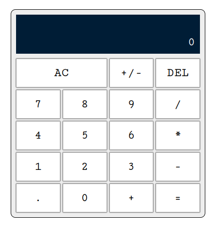

<a name="readme-top"></a>

<!-- TABLE OF CONTENTS -->

# 📗 Table of Contents

- [📖 About the Project](#about-project)
  - [🛠 Built With](#built-with)
    - [Tech Stack](#tech-stack)
    - [Key Features](#key-features)
- [💻 Getting Started](#getting-started)
  - [Setup](#setup)
  - [Prerequisites](#prerequisites)
  - [Install](#install)
  - [Usage](#usage)
  - [Run tests](#run-tests)
- [👥 Authors](#authors)
- [🤝 Contributing](#contributing)
- [⭐️ Show your support](#support)
- [📝 License](#license)

<!-- PROJECT DESCRIPTION -->

# 📖 Arrow Calculla <a name="about-project"></a>

**Arrow Calculla** is a simple calculator built with HTML, CSS, and vanilla JavaScript.
The main goal of this project was to focus on the logic of the operations and use functional programming to isolate and manage different use cases.

## 🛠 Built With <a name="built-with"></a>

### Tech Stack <a name="tech-stack"></a>

- HTML
- CSS
- JavaScript
- Webpack

<!-- Features -->

### Key Features <a name="key-features"></a>

- **Basic mathematical operations**
- **Using negative values**
- **Ability to delete numbers or operators**
- **Doing consequent operations after the equal sign or one of the operators**

<p align="right">(<a href="#readme-top">back to top</a>)</p>

<!-- LIVE DEMO -->

> This project is not deployed but you can run it locally

### Screenshot



<p align="right">(<a href="#readme-top">back to top</a>)</p>

<!-- GETTING STARTED -->

## 💻 Getting Started <a name="getting-started"></a>

To get a local copy up and running, follow these steps.

### Prerequisites

In order to run this project you need:

- Code Editor (VSCode for example)
- Terminal window (either inside VSCode or outside)
- Node installed on your machine

### Setup

Navigate to the folder you want & clone this repository:

```sh
  cd my-folder
  git clone git@github.com:Peter1907/calc.git
```

OR if you don't want to use ssh
```sh
  git clone https://github.com/Peter1907/calc.git
```

OR download a zip file & extract it using this [link](https://github.com/Peter1907/calc/archive/refs/heads/main.zip)

### Install

Install this project with:

```sh
  cd calc
  npm i
```

### Usage

To run the project, execute the following command:

```sh
  npm start
```

OR you can run the static version in the dist folder by opening the "index.html" file with any browser

### Run tests

> TO BE ADDED
<!-- To run tests, run the following command: -->

<!--
Example command:

```sh
  bin/rails test test/models/article_test.rb
```
--->

<!-- AUTHORS -->

## 👥 Authors <a name="authors"></a>

> Mention all of the collaborators of this project.

👤 **Myself**

- GitHub: [@Peter1907](https://github.com/Peter1907)
- LinkedIn: [Peter Beshara](https://linkedin.com/in/linkedinhandle)

<p align="right">(<a href="#readme-top">back to top</a>)</p>

<!-- CONTRIBUTING -->

## 🤝 Contributing <a name="contributing"></a>

Contributions, issues, and feature requests are welcome!

Feel free to check the [issues page](../../issues/).

<p align="right">(<a href="#readme-top">back to top</a>)</p>

<!-- SUPPORT -->

## ⭐️ Show your support <a name="support"></a>

Leave a star if you like this project⭐️

<p align="right">(<a href="#readme-top">back to top</a>)</p>

<!-- LICENSE -->

## 📝 License <a name="license"></a>

This project is [MIT](./LICENSE) licensed.

<p align="right">(<a href="#readme-top">back to top</a>)</p>
